# Информационная система «Автопарк»

[](https://docs.microsoft.com/en-us/dotnet/csharp/)
[](https://dotnet.microsoft.com/)
[](https://docs.microsoft.com/en-us/dotnet/desktop/wpf/)
[](https://www.mysql.com/)
[](docs/screenshots/test_results.png)


## Содержание

- [О проекте](#о-проекте)
- [Методология разработки](#методология-разработки)
- [Функциональность](#функциональность)
- [Технологический стек](#технологический-стек)
- [Архитектура и проектирование](#архитектура-и-проектирование)
- [Интерфейс программы](#интерфейс-программы)
- [Тестирование](#тестирование)

---

## О проекте

**Информационная система «Автопарк»** — это десктопное приложение для автоматизации учёта и управления автопарком организации. Разработано в рамках курсовой работы для колледжа (ЧУПО "ТЭТК") с целью демонстрации навыков проектирования и разработки информационных систем.

### Ключевые задачи

| Задача | Описание |
|--------|----------|
| Учёт ТС | Хранение информации о транспортных средствах, их техническом состоянии и статусе |
| Техобслуживание | Планирование и ведение истории технического обслуживания и ремонтов |
| Клиенты и сотрудники | Ведение базы клиентов и сотрудников автопарка |
| Аренда | Оформление и учёт операций аренды транспортных средств |
| Отчётность | Формирование отчётов по эксплуатации и ремонтам |

Проект включает **полный цикл разработки**: от составления технического задания и моделирования бизнес-процессов до реализации, тестирования и документирования.

---

## Методология разработки

| Этап | Инструменты | Результат |
|------|-------------|-----------|
| 1. Анализ требований | RAMUS (IDEF0) | Функциональные модели бизнес-процессов |
| 2. Проектирование | StarUML (UML) | Диаграммы классов, прецедентов, последовательности |
| 3. База данных | MySQL Workbench | ER-диаграмма, SQL-скрипты, триггеры |
| 4. Разработка | Visual Studio (C# + WPF) | Десктопное приложение |
| 5. Тестирование | MSTest | Модульные тесты (Unit Tests) |
| 6. Документация | MS Word | ТЗ, пояснительная записка, руководство пользователя |

---

## Функциональность

### Пользовательские роли

- **Сотрудник автопарка** — просмотр, добавление, редактирование и удаление данных об автомобилях, клиентах и операциях, оформление аренды.

### Основные модули

| Модуль | Возможности |
|--------|-------------|
| Авторизация и регистрация | Безопасный вход и создание учётных записей сотрудников |
| Управление ТС | Добавление автомобилей (марка, госномер, тип, статус, стоимость), фильтрация по статусу, типу и автопарку |
| Управление арендой | Выбор клиента и ТС, установка дат аренды, расчёт стоимости |
| Клиентская база | Хранение персональных данных, паспортной информации и контактов |
| Управление автопарками | Ведение базы мест хранения с указанием вместимости и адресов |

---

## Технологический стек

| Компонент | Технология |
|-----------|------------|
| **Язык программирования** | C# (.NET Framework) |
| **UI-фреймворк** | Windows Presentation Foundation (WPF) + XAML |
| **Архитектура** | Паттерн MVVM (реализован через код-бэхайнд) |
| **База данных** | MySQL Community Edition |
| **Доступ к данным** | ADO.NET + `MySql.Data.MySqlClient` (ручное написание SQL) |
| **IDE** | Microsoft Visual Studio 2022 |
| **СУБД** | MySQL Workbench |
| **Моделирование** | StarUML, RAMUS |

---

## Архитектура и проектирование

Проект начинался с анализа и проектирования. Функциональная модель предметной области разрабатывалась на основе методологии **IDEF0**.

<details>
<summary><b>Диаграммы IDEF0 (нажмите, чтобы развернуть)</b></summary>

### Контекстная диаграмма
Взаимодействие системы с внешним миром.

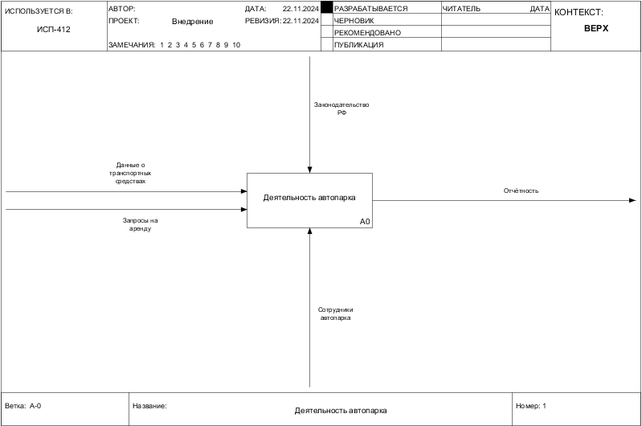

### Детализация первого уровня

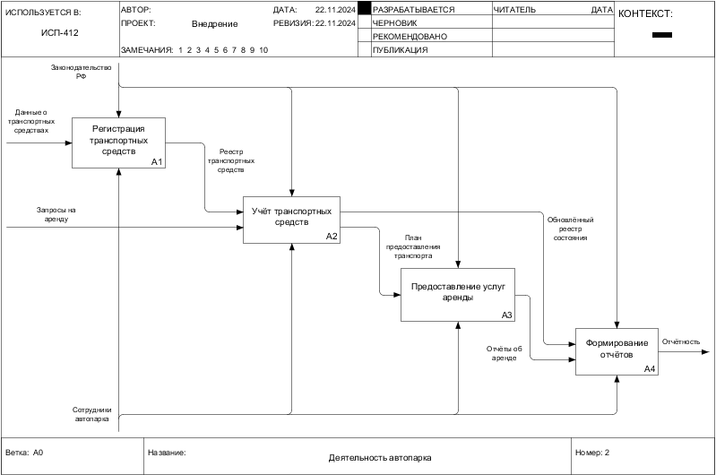

### Детализация процессов

| Процесс | Диаграмма |
|---------|-----------|
| Регистрация ТС | 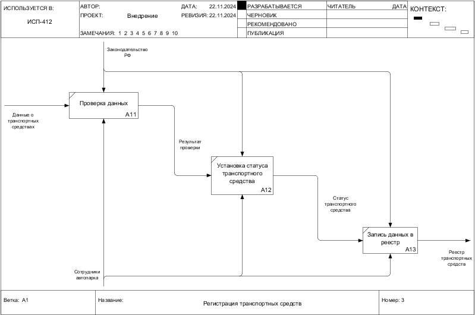 |
| Учёт ТС | 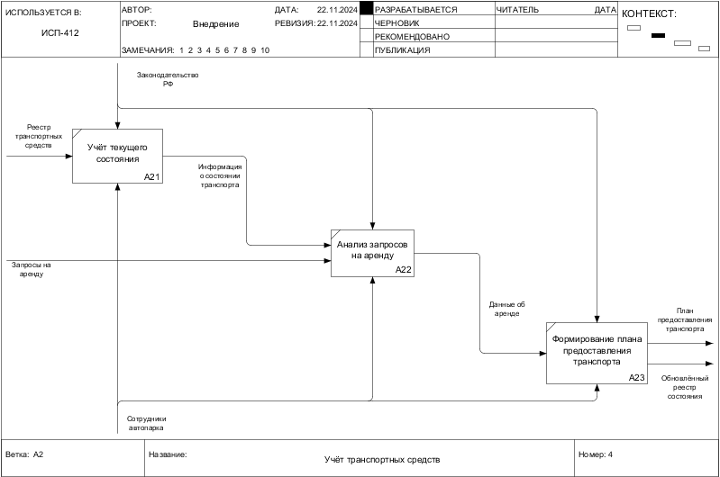 |
| Аренда ТС | 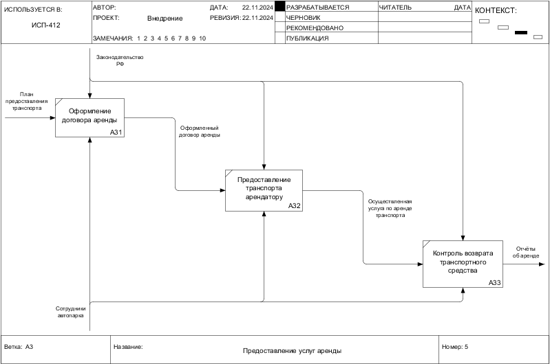 |
| Формирование отчётов | 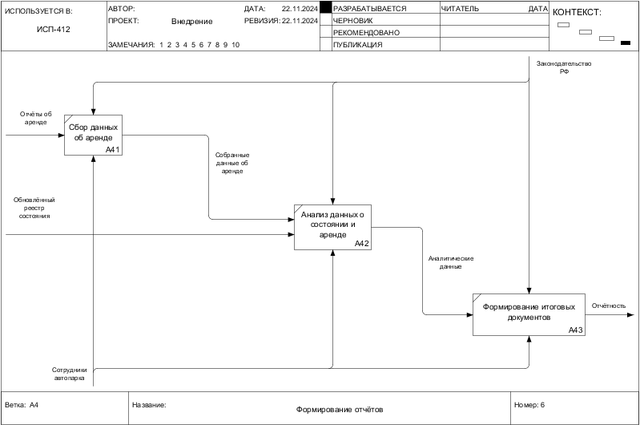 |

</details>

<details>
<summary><b>UML-диаграммы (нажмите, чтобы развернуть)</b></summary>

### Диаграмма прецедентов (Use Case)

| До автоматизации | После автоматизации |
|------------------|---------------------|
| 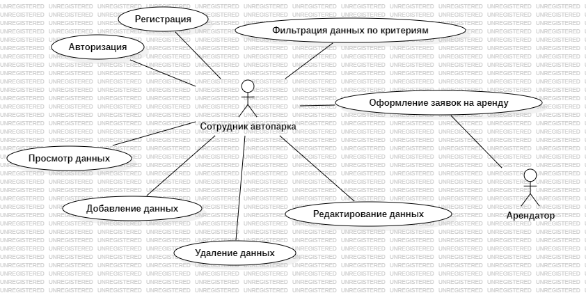 | 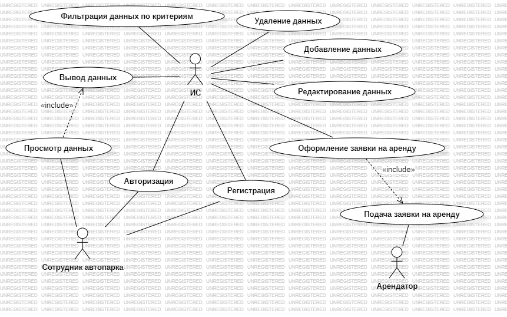 |

### Диаграмма классов

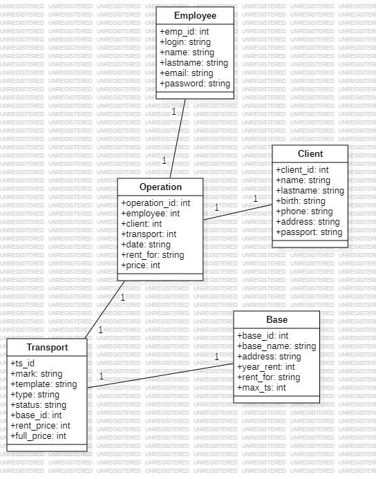

### Диаграмма последовательности (Sequence)

| До автоматизации | После автоматизации |
|------------------|---------------------|
| 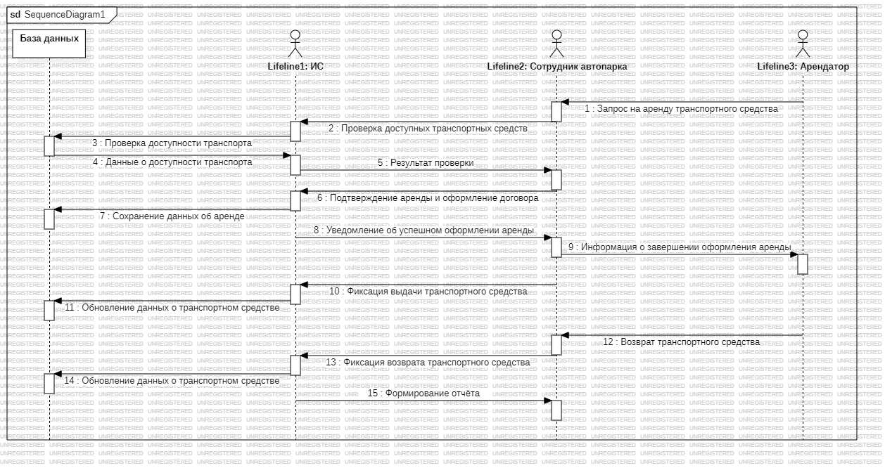 | 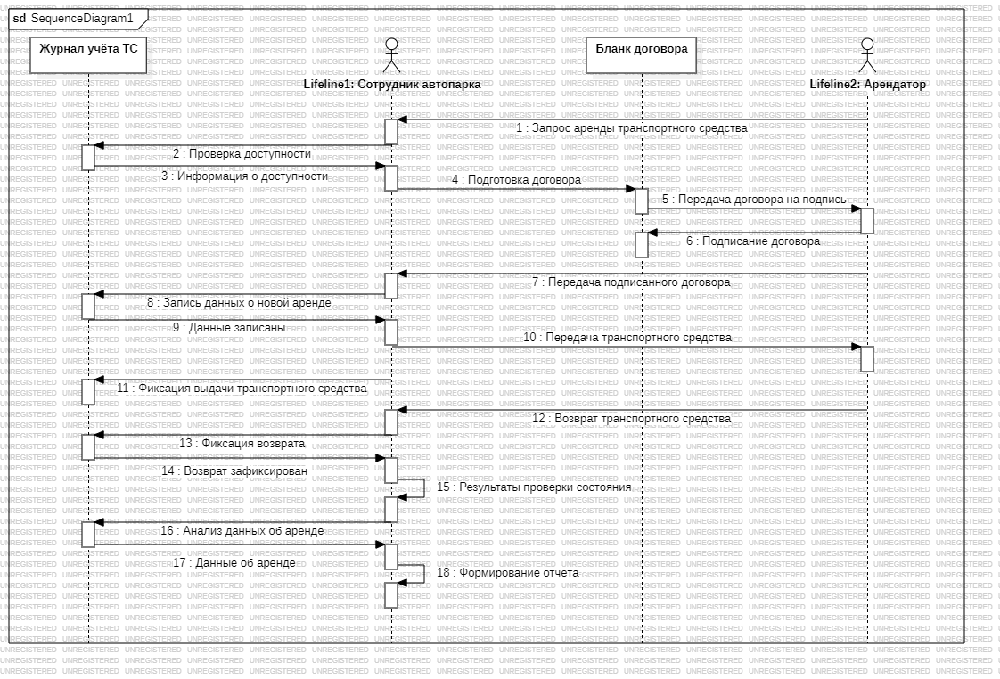 |

</details>

*Полный набор диаграмм (Activity, State, Component, Deployment) доступен в папке [`docs/diagram/`](docs/diagram/).*

---

## Интерфейс программы

### Авторизация и регистрация

| Авторизация | Регистрация |
|-------------|-------------|
| 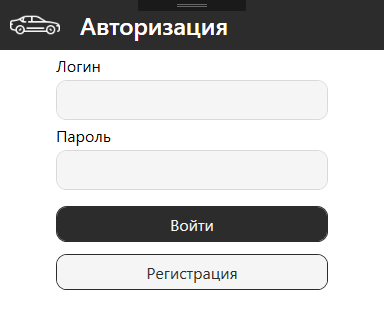 | 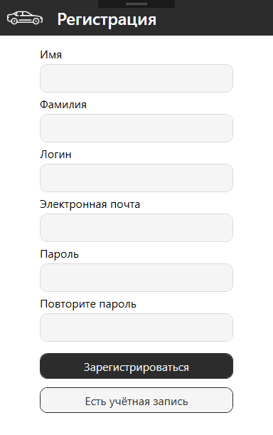 |

---

### Панель управления

Главное окно для навигации по разделам системы.

| Панель управления | Выбор таблиц БД |
|-------------------|-----------------|
|  |  |

---

### Регистрация новых записей

Формы для добавления транспортных средств, клиентов и операций аренды.

| Регистрация ТС | Регистрация клиента | Регистрация операции |
|----------------|---------------------|----------------------|
|  | 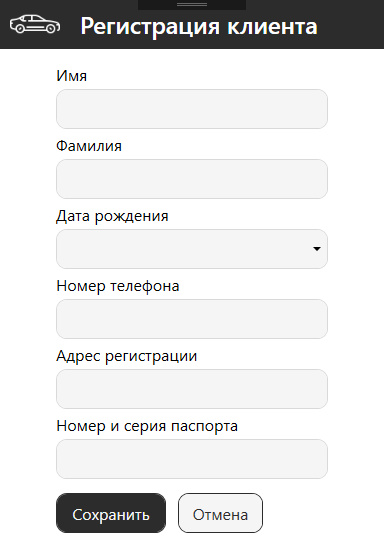 |  |

---

## Тестирование

В проекте реализованы **модульные тесты (Unit Tests)** для проверки ключевой логики приложения. Тесты написаны с использованием фреймворка **MSTest**.

### Покрытие тестами

- ✅ Валидация пароля (длина, заглавные/строчные буквы, цифры, спецсимволы)
- ✅ Проверка корректности вводимых данных
- ✅ Граничные случаи и обработка ошибок

### Результаты тестов

Все 6 тестов успешно пройдены ✅

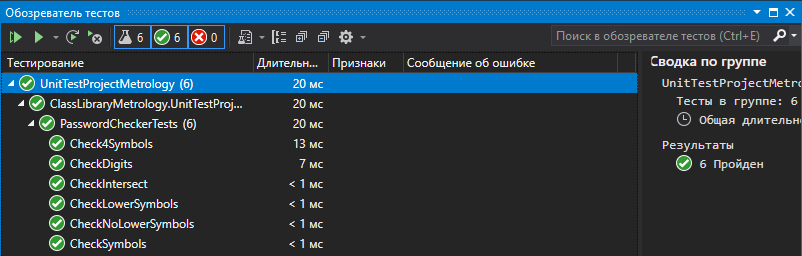

### Пример тестового метода

```csharp
using Microsoft.VisualStudio.TestTools.UnitTesting;

namespace ClassLibraryMetrology.UnitTestProjectMetrology
{
    [TestClass()]
    public class PasswordCheckerTests
    {
        [TestMethod()]
        public void CheckSymbols()
        {
            // Arrange
            string password = "abcD#$";
            bool expected = true;

            // Act
            bool actual = PasswordChecker.ValidatePassword(password);

            // Assert
            Assert.AreEqual(expected, actual);
        }

        [TestMethod()]
        public void CheckLength_ShortPassword_ReturnsFalse()
        {
            // Arrange
            string password = "aD45";

            // Act
            bool actual = PasswordChecker.ValidatePassword(password);

            // Assert
            Assert.IsFalse(actual);
        }

        [TestMethod()]
        public void CheckLowerSymbols()
        {
            // Arrange
            string password = "ABCD3F!$";
            bool expected = true;

            // Act
            bool actual = PasswordChecker.ValidatePassword(password);

            // Assert
            Assert.AreEqual(expected, actual);
        }

        [TestMethod()]
        public void CheckNoLowerSymbols_ReturnsFalse()
        {
            // Arrange
            string password = "ABCD3F!$";
            bool expected = false;

            // Act
            bool actual = PasswordChecker.ValidatePassword(password);

            // Assert
            Assert.AreEqual(expected, actual);
        }

        [TestMethod()]
        public void CheckDigits_ReturnsTrue()
        {
            // Arrange
            string password = "ABcD3F!$";
            bool expected = true;

            // Act
            bool actual = PasswordChecker.ValidatePassword(password);

            // Assert
            Assert.AreEqual(expected, actual);
        }

        [TestMethod()]
        public void CheckSpecialChars_ReturnsTrue()
        {
            // Arrange
            string password = "ABcD3F!$";
            bool expected = true;

            // Act
            bool actual = PasswordChecker.ValidatePassword(password);

            // Assert
            Assert.AreEqual(expected, actual);
        }
    }
}
