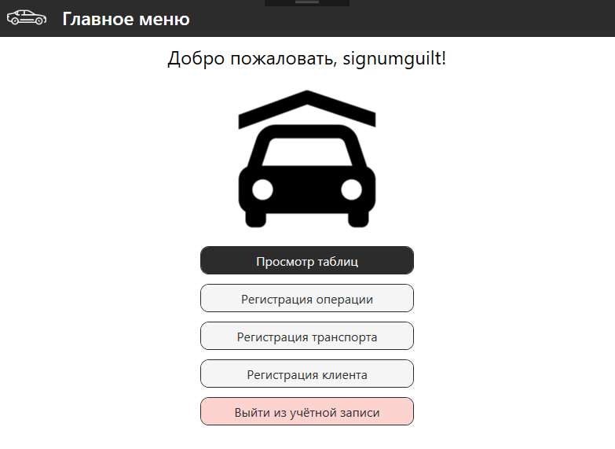
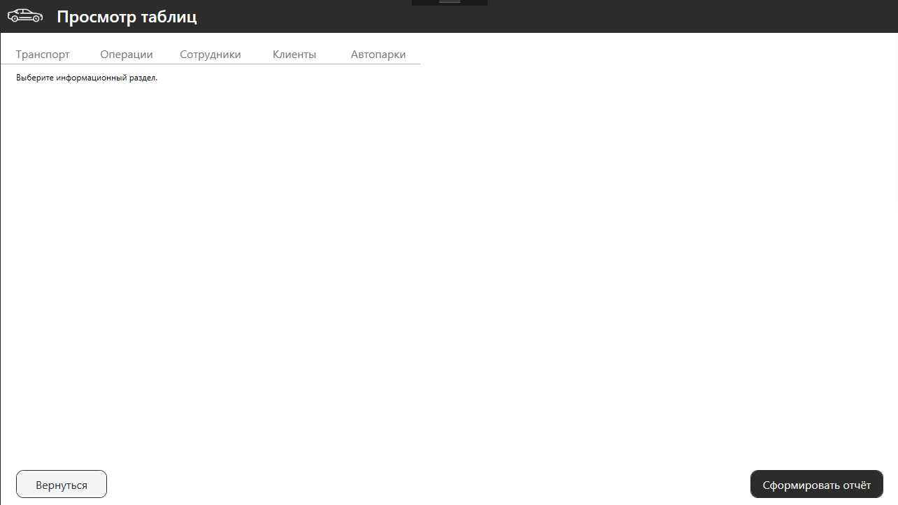
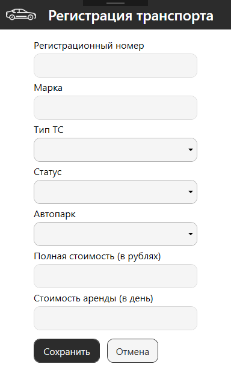
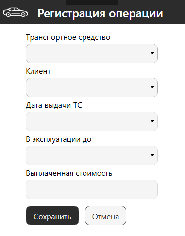

# Информационная система «Автопарк»

## О проекте

**Информационная система «Автопарк»** — это десктопное приложение для автоматизации учета и управления автопарком организации. Разработано в рамках курсовой работы для колледжа (ЧУПО "ТЭТК") с целью демонстрации навыков проектирования и разработки информационных систем.

Приложение решает ключевые задачи:
-  Учет транспортных средств, их технического состояния и статуса.
-  Планирование и ведение истории технического обслуживания (ТО).
-  Ведение базы клиентов и сотрудников.
-  Оформление и учет операций аренды транспортных средств.
-  Формирование отчетов по эксплуатации и ремонтам.

Проект включает в себя полный цикл разработки: от составления технического задания и моделирования бизнес-процессов до реализации, тестирования и документирования.

## Методология разработки

1. **Анализ требований** — изучение предметной области, построение IDEF0-моделей
2. **Проектирование** — UML-диаграммы в StarUML
3. **База данных** — проектирование в MySQL Workbench
4. **Разработка** — WPF + C# на .NET Framework
5. **Тестирование** — модульные тесты (MSTest)
6. **Документация** — ТЗ, пояснительная записка, руководство пользователя

## Функциональность

### Пользовательские роли
- **Сотрудник автопарка:** может просматривать, добавлять, редактировать и удалять данные об автомобилях, клиентах и операциях, а также оформлять аренду.

### Основные модули
1.  **Авторизация и регистрация:** Безопасный вход и создание новых учетных записей сотрудников.
2.  **Управление ТС:**
    - Добавление новых автомобилей (марка, модель, госномер, тип, статус, стоимость аренды).
    - Фильтрация автомобилей по статусу, типу и месту расположения (автопарку).
3.  **Управление арендой (операции):**
    - Выбор клиента и автомобиля для оформления аренды.
    - Установка дат начала и окончания аренды.
    - Расчет стоимости аренды.
4.  **Клиентская база:** Хранение персональных данных, паспортной информации и контактов клиентов.
5.  **Управление автопарками:** Ведение базы мест хранения автомобилей с указанием вместимости и адресов.

## Технологический стек

- **Язык программирования:** C# (.NET Framework)
- **UI-фреймворк:** Windows Presentation Foundation (WPF) с использованием XAML и паттерна MVVM (реализован через код-бэхайнд).
- **База данных:** MySQL
- **ORM / ADO.NET:** Ручное написание SQL-запросов и использование `MySql.Data.MySqlClient` для взаимодействия.
- **Среды разработки:**
    - **IDE:** Microsoft Visual Studio 2022
    - **СУБД:** MySQL Workbench
- **Моделирование:** StarUML (UML-диаграммы)

## Архитектура и проектирование

Проект начинался с анализа и проектирования. Функциональная модель предметной области разрабатывалась на основе методологии IDEF0:

### Контекстная диаграмма (IDEF0)
Показывает взаимодействие системы с внешним миром.

### Диаграмма прецедентов (Use Case)
Описание ролей пользователей и их возможностей.

### Диаграмма классов
Основная структура данных и связи между сущностями.

### Диаграмма последовательности
Пример процесса оформления аренды автомобиля.

*Полный набор диаграмм (включая Activity, State, Component, Deployment) доступен в папке [docs/diagrams/](docs/diagram/).*

## Интерфейс программы

### Авторизация и регистрация
Вход в систему и создание новой учётной записи сотрудника.

| Авторизация | Регистрация |
|-------------|-------------|
|  |  |

---

### Панель управления
Главное окно для навигации по разделам системы.

---

### Регистрация новых записей
Формы для добавления транспортных средств, клиентов и операций аренды.

| Регистрация ТС | Регистрация клиента | Регистрация операции |
|----------------|---------------------|----------------------|
|  |  |  |
